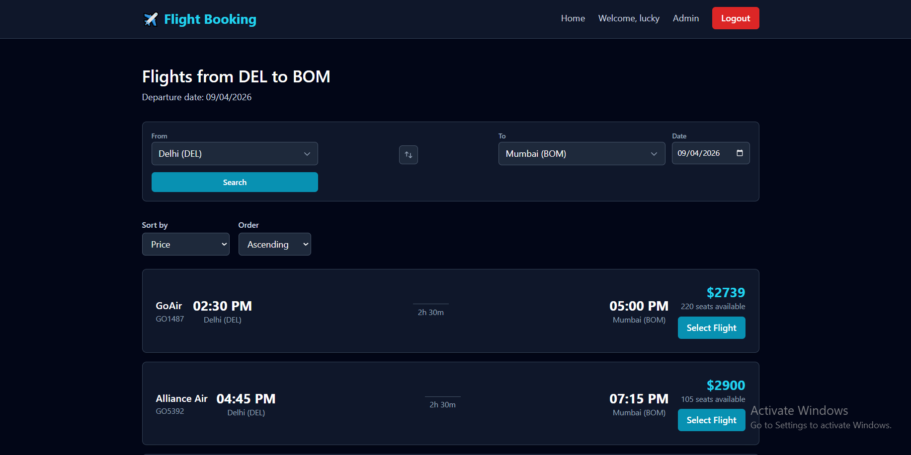
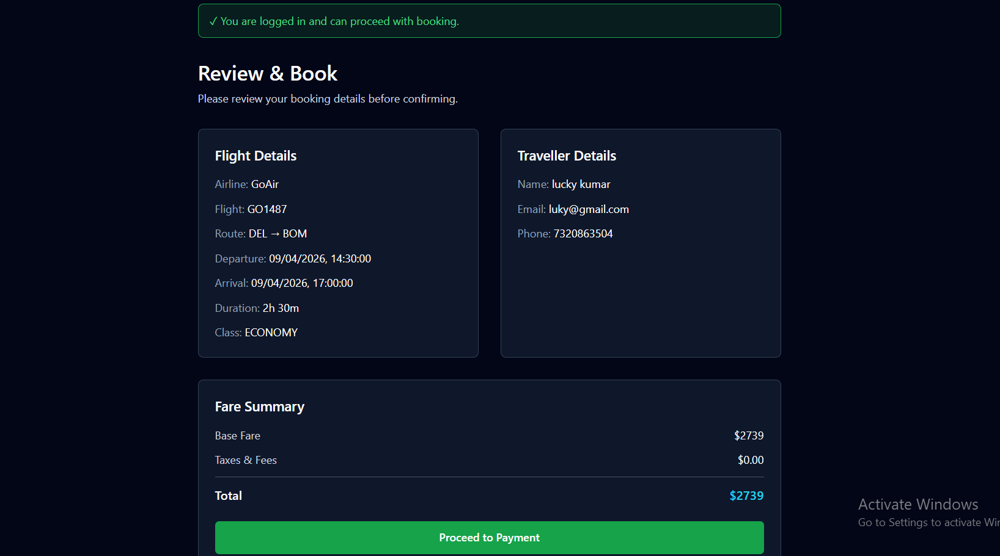
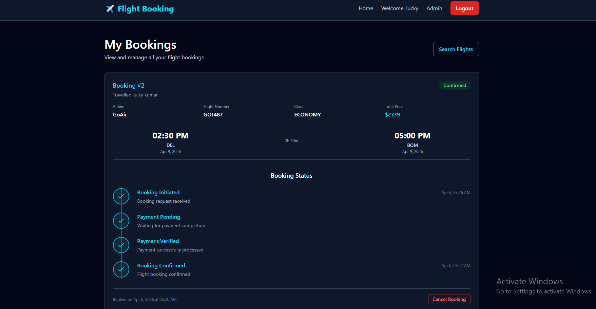
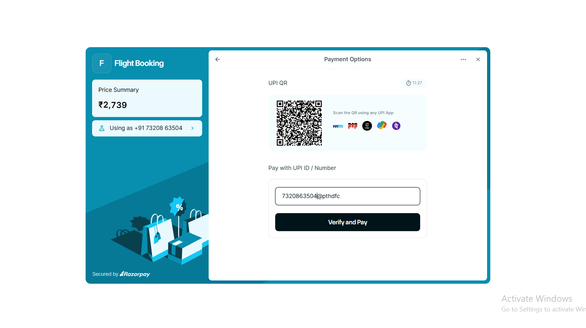

# Flight Booking and Confirmation System

A production-style full stack travel-tech project built to showcase product engineering skills across **flight search, filtering, sorting, traveller details, authentication, booking persistence, Razorpay sandbox payments, fare recheck, booking lifecycle visibility, and admin-lite booking operations**.

This project is designed as a strong portfolio piece for **frontend-focused full stack**, **full stack**, and **product/product-engineering** roles, especially for travel-tech and transaction-heavy systems.

## Tech Stack

### Frontend
- Next.js
- TypeScript
- Tailwind CSS
- React Context for auth state
- Razorpay Checkout integration

### Backend
- Node.js
- Express.js
- TypeScript
- Prisma
- SQLite (local development)
- JWT authentication
- bcrypt password hashing
- Razorpay sandbox payment verification

## Core Features

### Flight Discovery
- Flight search form
- Source and destination search
- Results page
- Filters
- Sorting
- Flight details page
- Clean loading, empty, and error states

### Booking Flow
- Traveller details form
- Fare summary
- Protected booking review flow
- Fare recheck before payment
- Seat availability validation before payment
- Razorpay sandbox payment flow
- Booking confirmation page

### Authentication
- Signup
- Login
- Logout
- JWT-based auth APIs
- Browser-persisted auth state
- Redirect back to booking flow after login

### Booking Management
- Booking persistence in database
- Protected My Bookings page
- Booking cards with flight and traveller summary
- Booking status timeline
- Cancel booking flow for eligible bookings

### Admin-lite Ops
- Protected `/ops/bookings` page
- View all bookings
- Filter by booking status
- Update booking status
- View traveller and flight summary

## Booking Lifecycle

The app supports visible booking lifecycle states such as:

- `initiated`
- `payment_pending`
- `payment_verified`
- `confirmed`
- `cancelled`

These states are surfaced in the booking timeline and admin-lite dashboard.

## Routes

### Frontend
- `/` → Flight search homepage
- `/results` → Search results
- `/flights/[id]` → Flight details
- `/book/[id]` → Protected booking review and payment flow
- `/my-bookings` → Protected user bookings page
- `/ops/bookings` → Protected admin-lite bookings dashboard
- `/login` → Login
- `/signup` → Signup

### Backend
- `GET /api/health`
- `GET /api/flights`
- `GET /api/flights/:id`
- `POST /api/auth/signup`
- `POST /api/auth/login`
- `POST /api/bookings`
- `GET /api/bookings`
- `PATCH /api/bookings/:id/cancel`
- `GET /api/admin/bookings`
- `PATCH /api/admin/bookings/:id`
- `POST /api/payments/fare-recheck`
- `POST /api/payments/create-order`
- `POST /api/payments/verify`

## Screenshots

### Search Results


### Booking Review


### My Bookings


### Razorpay Payment


## Local Setup

### 1. Clone the repository
```bash
git clone https://github.com/rampravesh19-96/flight-booking-system.git
cd flight-booking-system